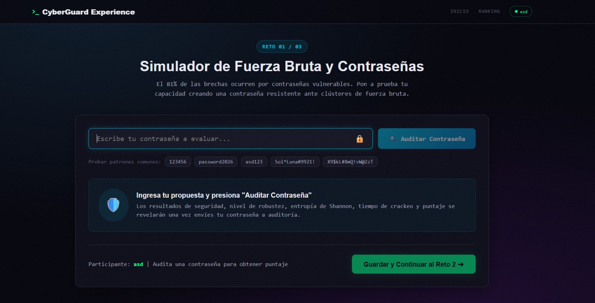
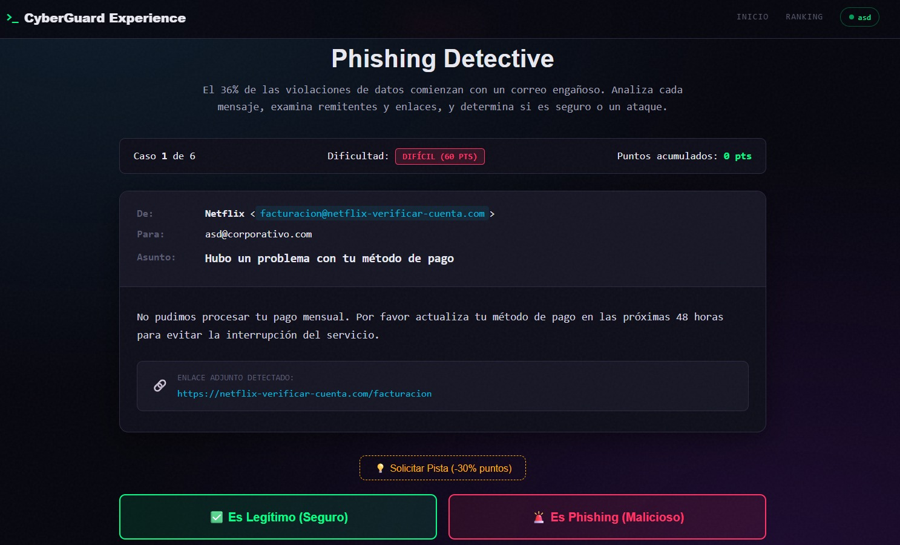
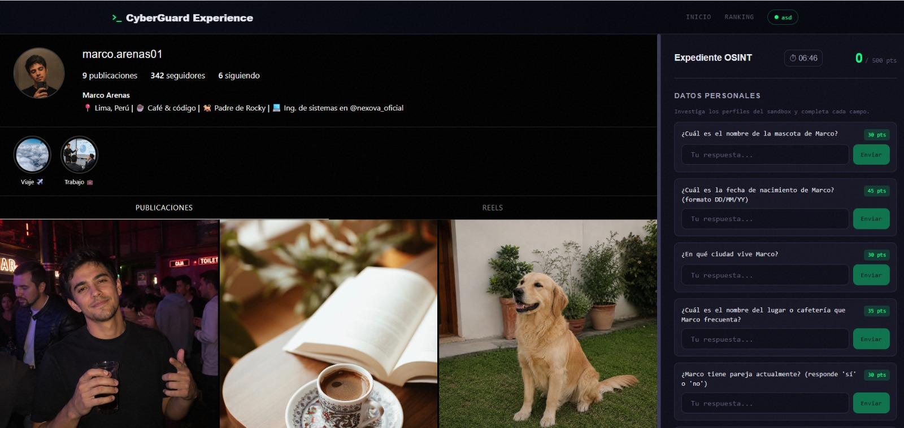
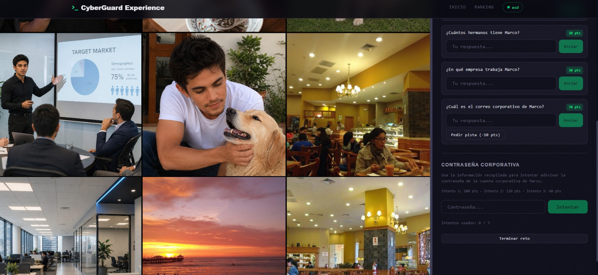
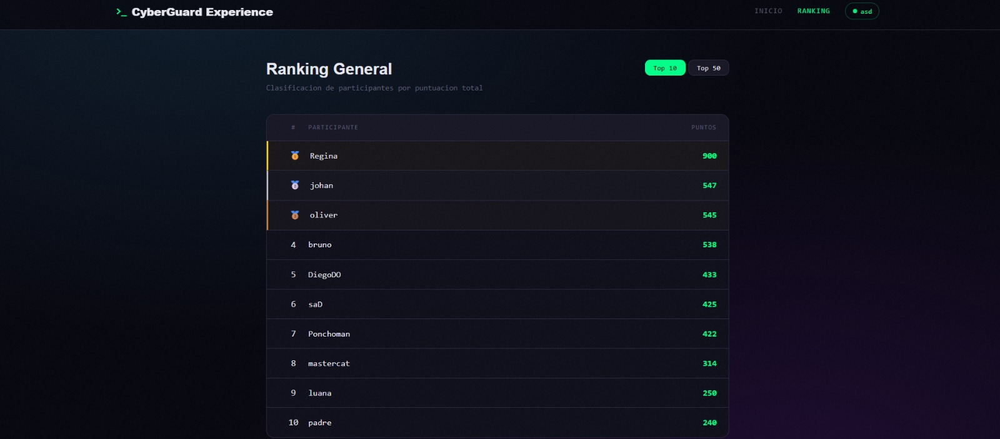

<p align="center">
  
</p>

> **Pon a prueba tus habilidades. Identifica las amenazas. Aprende mientras juegas.**

---

# Objetivo

El objetivo del proyecto es acercar conceptos de ciberseguridad a los participantes mediante una experiencia práctica, interactiva y educativa.

En lugar de limitarse a explicar las amenazas de forma teórica, CyberGuard Experience permite que los usuarios interactúen con escenarios controlados y descubran por sí mismos cómo identificar riesgos y tomar mejores decisiones de seguridad.

La plataforma está diseñada para poder ser utilizada por personas con diferentes niveles de conocimiento en ciberseguridad.

---
# Equipo

El proyecto fue desarrollado por un equipo de tres integrantes, donde cada integrante trabajó principalmente en un reto independiente:

| Módulo                | Área                                      | Integrante  |
| --------------------- | ----------------------------------------- |-------------|
| Password Challenge | Seguridad de contraseñas                  |Alvaro Antonio Canchaya Espinoza
| Phishing Detective | Detección de phishing e ingeniería social |Martin Alberto Benites Marin
| OSINT Challenge   | Investigación con fuentes abiertas        |Regina Sofia Villacriz Villavicencio

Esta organización permitió el desarrollo simultáneo de los módulos, manteniendo interfaces y responsabilidades separadas para facilitar la integración final.

---

# Retos

## 🔐 Password Challenge

Este reto permite al participante evaluar la seguridad de una contraseña mediante un entorno controlado.



El sistema analiza características como:

* Longitud.
* Complejidad.
* Uso de patrones predecibles.
* Presencia de palabras comunes.
* Uso de números o años.
* Repeticiones.

> 👨‍💻 **Desarrollador:** Alvaro Antonio Canchaya Espinoza (EL GRAN TONY)

---

## 🎣 Phishing Detective

Un reto interactivo en el que el participante debe analizar diferentes correos electrónicos y determinar si son:

* 🟢 **Legítimos**
* 🔴 **Phishing**



Los escenarios incluyen distintos indicadores y técnicas, como:

* Dominios sospechosos.
* Urgencia artificial.
* Suplantación de identidad.
* Solicitudes de credenciales.
* Enlaces sospechosos.
* Ingeniería social.

Después de cada respuesta, el usuario recibe feedback educativo que explica los indicadores presentes en el escenario.

Todos los correos y escenarios utilizados son ficticios y han sido diseñados exclusivamente para fines educativos.

> 👨‍💻 **Desarrollador:** Martin Alberto Benites Marin

---

## 🕵️ OSINT Challenge

Un reto de investigación basado en **Open Source Intelligence (OSINT)**.




El participante debe analizar una cuenta de Instagram y correlacionar información para resolver un desafío.

El reto involucra información como:

* Nombres
* Fechas
* Perfiles familiares
* Ciudad
* Lugares concurrentes
* Correos
* Empresas

El objetivo es demostrar cómo la información aparentemente aislada puede convertirse en conocimiento útil cuando es investigada y correlacionada.

> 👩‍💻 **Desarrolladora:** Regina Sofia Villacriz Villavicencio
---

# Experiencia del usuario

La experiencia está diseñada como una plataforma gamificada:

```text
                    🛡️ CYBERGUARD EXPERIENCE
                              │
              ┌───────────────┼───────────────┐
              │               │               │
              ▼               ▼               ▼
        🔐 PASSWORD       🎣 PHISHING       🕵️ OSINT
          CHALLENGE         DETECTIVE       CHALLENGE
              │               │               │
              └───────────────┼───────────────┘
                              ▼
                      🏆 CYBERGUARD SCORE
                              │
                              ▼
                       SECURITY LEVEL
```

Los participantes pueden completar los diferentes retos y obtener puntuaciones basadas en su desempeño.



El objetivo final es ofrecer una experiencia rápida, entretenida y educativa que pueda completarse aproximadamente en unos minutos durante un evento.

---
# Seguridad y privacidad

CyberGuard Experience fue diseñado con fines educativos.

Por ello:

* No se realizan ataques contra sistemas reales.
* No se utilizan credenciales reales.
* No se almacenan contraseñas reales.
* No se envían correos electrónicos reales.
* Los escenarios de phishing y OSINT son ficticios.
* Los enlaces utilizados en las simulaciones no conducen a sitios maliciosos reales.
* Los retos se ejecutan en un entorno controlado.
* No se requiere información personal sensible para participar.

El proyecto busca enseñar conceptos de ciberseguridad de forma responsable y segura.

---

<p align="center">
  <b>🛡️ CyberGuard Experience</b>
  <br>
  <i>Pon a prueba tus habilidades. Identifica las amenazas. Aprende mientras juegas.</i>
</p>
